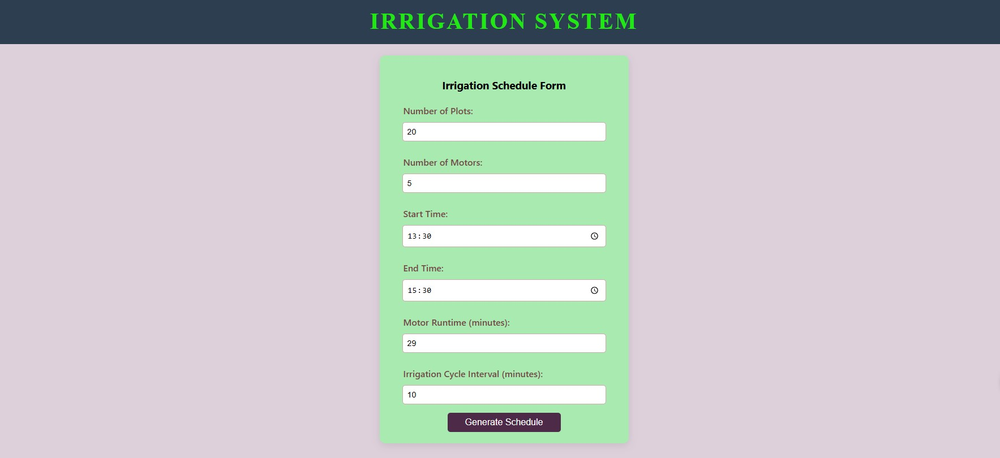

## Irrigation System

🔗 **[Live Demo Here](https://irrigation-syst.netlify.app)**

    A responsive, user-friendly web application for smart irrigation management built with React.js.

## Features :
    Display and monitor irrigation system data
    Responsive UI for all devices
    Built using modern React practices

## Installation :
    1. Clone the repository:
    git clone https://github.com/your-username/your-repo-name.git

    2. Navigate to the project directory:
    cd your-repo-name

    3. Install dependencies:
    npm install

## Build Instructions :
    1. To run the app locally:
    npm start

    2. To create a production build:
    npm run build
    This will generate a build/ folder with optimized production-ready code.

## Deployment (for Netlify) :
    After building the project (npm run build),
    deploy the contents of the build/ folder on Netlify.

## On Netlify:
    Drag and drop the build/ folder.
    Or connect your GitHub repo and set the Build Command to npm run build and Publish directory to build.

## Screenshots :
### irrigationForm

### irrigation schedule

## License
    This project is licensed under the MIT License.

## Acknowledgements
    Built with React.js
    Hosted on Netlify